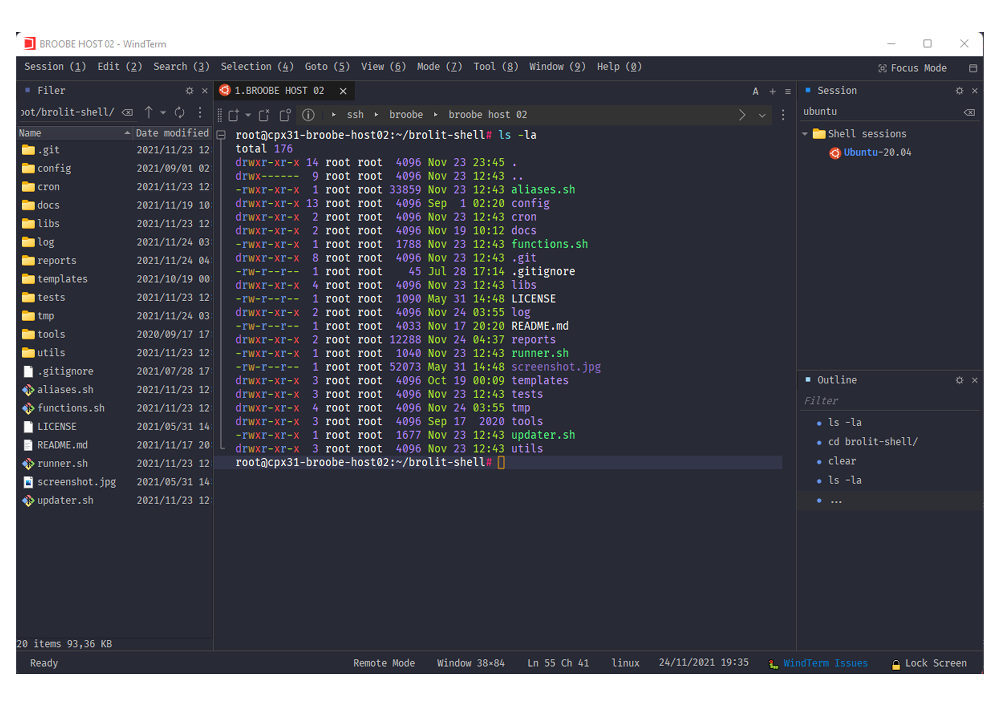

# Dracula for [WindTerm](https://github.com/kingToolbox/WindTerm)

> A dark theme for [WindTerm](https://github.com/kingToolbox/WindTerm).

## Install

All instructions can be found at [draculatheme.com/windterm](https://draculatheme.com/windterm).

## Team

This theme is maintained by the following person(s) and a bunch of [awesome contributors](https://github.com/dracula/windterm/graphs/contributors).

 |
--- |
[Leandro Padula](https://github.com/lpadula) |

## License

[MIT License](./LICENSE)